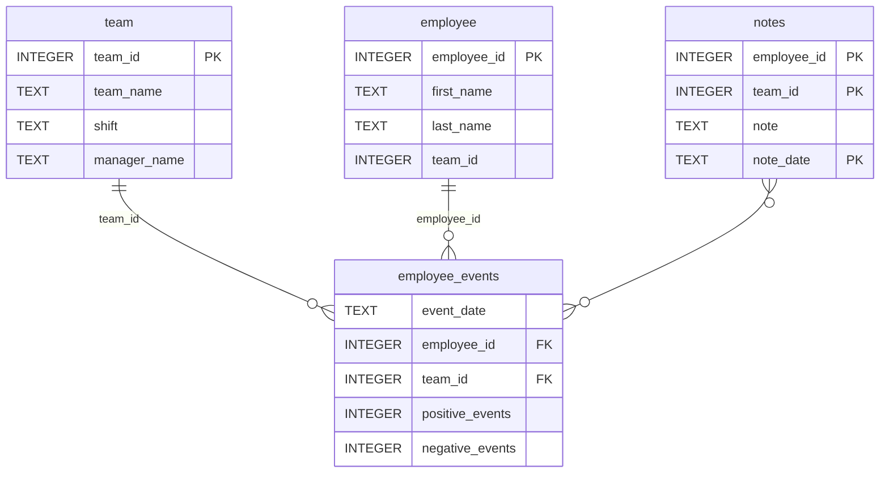

# Software Engineering for Data Scientists 

This repository contains starter code for the **Software Engineering for Data Scientists** final project. Please reference your course materials for documentation on this repository's structure and important files. Happy coding! 

### Repository Structure
```
├── README.md
├── assets
│   ├── model.pkl
│   └── report.css
├── env
├── python-package
│   ├── employee_events
│   │   ├── __init__.py
│   │   ├── employee.py
│   │   ├── employee_events.db
│   │   ├── query_base.py
│   │   ├── sql_execution.py
│   │   └── team.py
│   ├── requirements.txt
│   ├── README.md
│   ├── setup.py
├── report
│   ├── base_components
│   │   ├── __init__.py
│   │   ├── base_component.py
│   │   ├── data_table.py
│   │   ├── dropdown.py
│   │   ├── matplotlib_viz.py
│   │   └── radio.py
│   ├── combined_components
│   │   ├── __init__.py
│   │   ├── combined_component.py
│   │   └── form_group.py
│   ├── dashboard.py
│   └── utils.py
├── requirements.txt
├── start
├── tests
│   └── test_employee_events.py
├── .flake8 
```

### employee_events.db



### Repository structure updates

`python-package/README.md` is included to satisfy setuptools packaging requirements when building the source distribution.  
A `.flake8` file is included to configure project-specific linting rules.

### Linting note

Some files included as **framework or starter code** are not meant to be modified.  
These include **FastHTML components that require `import *`**, **embedded JavaScript blocks**, and **auxiliary scripts not used at runtime**.  
Such files are explicitly **ignored via per-file rules in `.flake8`**, while project-specific code remains linted
